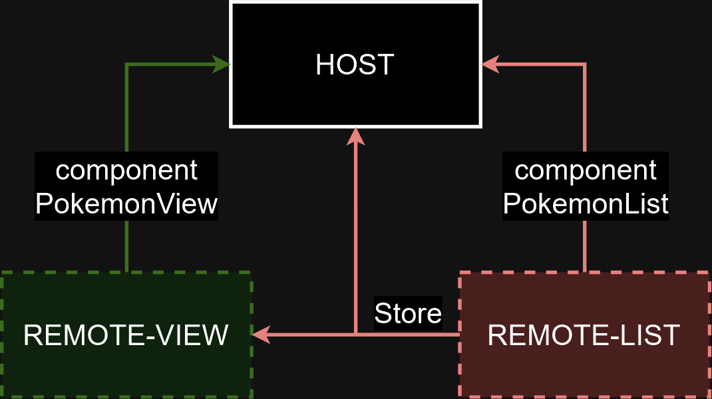
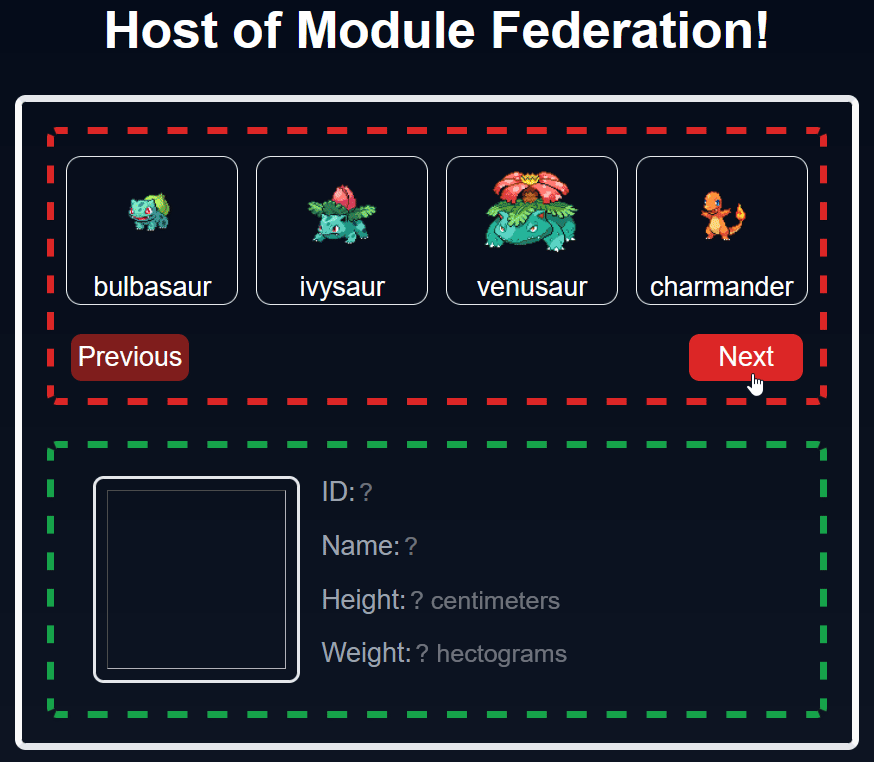

# Viewing Pokémon on Microfrontends using Module Federation

## Application Structure



## Operation



## Running

### Install

```shell
pnpm i
```

### Start

```shell
pnpm run dev
```

### Open

Open http://localhost:3000/ in browser